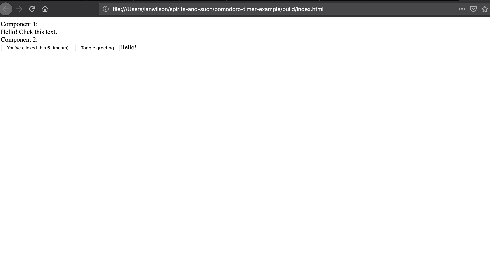
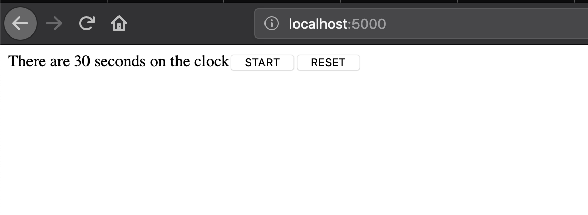
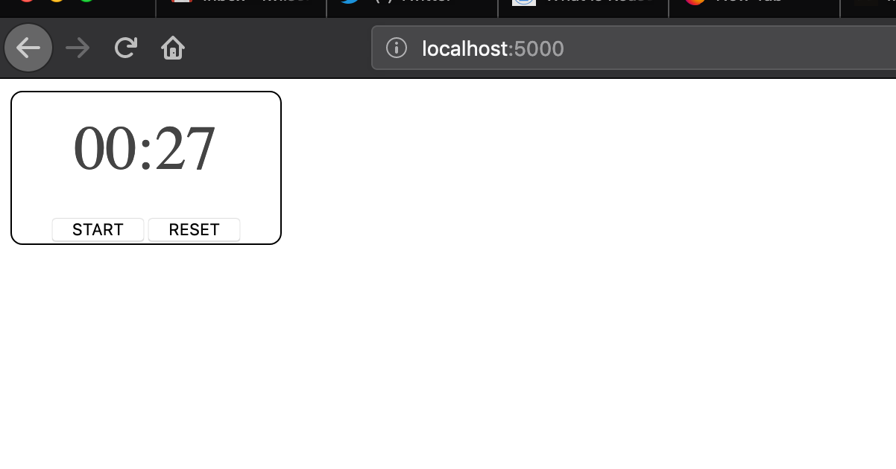
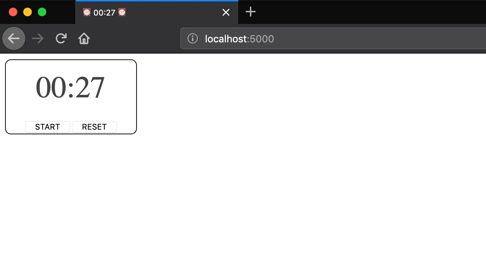

ReasonML is a programming language that combines the simplicity of JavaScript with the performance of OCaml. JavaScript programmers should give ReasonML a try. Reason's inherits OCaml's typesystem as well as the approachability of JavaScript.

With [ReasonReact](https://reasonml.github.io/reason-react/) and [BuckleScript](https://bucklescript.github.io/), we can compile Reason code to JavaScript that works like good old React.

But that's not all, things are getting even better for the Reason ecosystem. Earlier last week, ReasonReact [version 0.7.0 dropped](https://reasonml.github.io/reason-react/blog/2019/04/10/react-hooks), with support for React hooks. We can now build robust components with React hooks that:

- eliminate duplicated lifecycle logic (like in componentDidMount, componentDidUpdate, and componentWillUnmount)
- eliminate the need for complicated patterns like higher-order components or render props
- allow _easier refactoring_ of stateful components

Think for a moment about that last point, what else give us easier refactorability?

A rock solid typesystem and a helpful compiler!

Today, we're going to build a Pomodoro Timer [like this](https://tomato-timer.com/) using Reason and React.

A pomodoro timer allows you to set a timer for say 25 or 30 minutes that lets you know when to stop working. Because sometimes taking a break is good, and you better believe I'm using one while writing this.

## Initializing a Project

The first step is to install BuckleScript, a tool that will compile our Reason code to JavaScript.

```sh
npm install -g bs-platform
```

After that, we can scaffold our project with the `init` command, and setting the `theme` to react-hooks.

```sh
bsb -init pomodoro-timer -theme react-hooks
cd pomodoro-timer && npm install
```

Now that our project set up, we can mention our folder layout. Our Reason code belongs in the src directory. Where we usually have an index.js file in a JavaScript React project, we have an Index.re file. These files serve the same purpose: render the app root.

Since our code will compile to JavaScript, I still like to have a bundler like Webpack to bundle those files.

<blockquote>Tip: It is generally considered a best practice to keep your folder structure as flat as possible with ReasonML, using captialized file names (like Timer.re). See the [ReasonML docs](https://reasonml.github.io/docs/en/project-structure#folders) for a discussion on project structure.</blockquote>

### Running the code

Before I clean up the environment, let us try running the code. This will need two or three separate terminal tabs:

```sh
# in one tab
npm start
```

This runs `bsb -make-world -w` which compiles your Reason files on every change. It does this quickly, mind you.

```sh
# in another tab
npm run webpack
```

This command takes our compiled JavaScript and spits out a bundle that we can then open in a browser using:

```sh
open build/index.html
```

I prefer use a static file server like [zeit/serve](https://github.com/zeit/serve).

```sh
# install `serve` globally
npm i -g serve

# serve it!
serve build/
```



### Cleaning up the Environment

I want to clean up the default project structure before writing an implementation.

1. Remove the Component1.re and Component2.re files, we will not be using these. You can still read them and try to making sense of how hooks are working in our new environment.
2. Replace index.html with the following:

```html
<!DOCTYPE html>
<html lang="en">
  <head>
    <meta charset="UTF-8" />
    <title>Pomodoro Timer</title>
  </head>
  <body>
    <div id="root"></div>
    <script src="Index.js"></script>
  </body>
</html>
```

3. Replace Index.re with the following:

```reason
ReactDOMRe.renderToElementWithId(<Timer />, "root");
```

4. Open up bsconfig.json and change the field "in-source" from true to false. This will output our compiled JavaScript into the lib/js directory. I prefer this over leaving them inside of our root src directory.

5. Tell webpack to build from the new location by changing webpack.config.js to the following:

```js
module.exports = {
  entry: './lib/js/src/Index.bs.js',
  // rest of webpack config
}
```

And now with all out that taken care of, we can begin the fun part, the implementation.

## Building a Stateless Component

After cleaning up, notice that we are trying to render a `Timer` component but we have not even defined one. Let us write a stateless component to render to the page.

```reason
[@react.component]
let make = () => {
  <div> {ReasonReact.string("One day this will be a timer")} </div>;
};
```

I want to highlight how simple this code is. Writing a stateless React component in the previous version was more verbose:

```reason
/* DO NOT WRITE THIS */
let component = ReasonReact.statelessComponent("Timer");
let make = () => {
  ...component,
  render: _children =>  <div> {ReasonReact.string("One day this will be a timer")} </div>;
};
```

Even compared to regular JavaScript with React, this new syntax is incredibly slick. With Reason projects, we do not need to layer imports on top of the file every time we make a new file.

## The useReducer Hook

Now we are going to introduce some state into this equation. We do not have any "class" components, we are still using functional components. But now we are going to use React hooks to compose a solution.

For our timer, we need to keep track of at least two things:

1. The seconds on the clock
2. Whether it is ticking or not

When we consider any timer, we usually have three buttons: `Start`, `Stop`, and `Reset`. These map to directly to user interactions, but there is one more: the `Tick` itself. Even though the tick is not controlled by the user, it is still an action that should return a new state for our reducer.

At the top of Timer.re, where we will build this whole app, add the following:

```reason
type state = {
  seconds: int,
  isTicking: bool
};

type action =
  | Start
  | Stop
  | Reset
  | Tick;
```

How easy it is, to implement an application after you have described your states needs and actions!

Next we'll update our make function to use a reducer:

```reason
[@react.component]
let make = () => {
  let (state, dispatch) =
    React.useReducer(
      (state, action) =>
        switch (action) {
        | Start => {...state, isTicking: true}
        | Stop => {...state, isTicking: false}
        | Reset => {...state, seconds: 30}
        | Tick => {...state, seconds: state.seconds - 1}
        },
      {isTicking: false, seconds: 30},
    );

  <div>
    {ReasonReact.string(
       "There are " ++ string_of_int(state.seconds) ++ " on the clock",
     )}
  </div>;
};
```

The syntax is like that of ReactJS. The `useReducer` function returns a tuple as opposed an array. This is because JavaScript does not know what the heck a tuple is. We make sure to handle each of our action types inside this reducer, returning a whole copy of the state.

The second argument to `useReducer` is the initial state of the reducer. It would make sense for the time to receive the initial time as a prop but I'll leave it this way for now.

Now we need a way to invoke these actions. Let us start with the `Tick` because it is the most complicated bit.

## The useEffect hook

To update the timer every second, we need to create an effect. In the JavaScript world, this means putting a callback function within `setInterval`.

Let us add this hook between the `useReducer` function and the returned JSX.

```reason
React.useEffect0(() => {
  let timerId = Js.Global.setInterval(() => dispatch(Tick), 1000);
  Some(() => Js.Global.clearInterval(timerId));
});
```

If you recall the way `useEffect` works:

- The first argument is a callback function that runs when the component mounts, updates, or unmounts.
- Optionally, the callback function can return another function that performs cleanup. This includes unsubscribing from sockets or clearing a setInterval so it does not persist forever.

If you run the code and refresh your browser, you'll see that our timer is going to run indefinitely.

It should not do this, so lets update our reducer again to account for whether the `isTicking` flag is true or false. We will also make sure that `seconds` are greater than zero so we do not go negative.

```reason
let (state, dispatch) =
    React.useReducer(
      (state, action) =>
        switch (action) {
        | Start => {...state, isTicking: true}
        | Stop => {...state, isTicking: false}
        | Reset => {...state, seconds: 30}
        | Tick => state.isTicking && state.seconds > 0
            ? {...state, seconds: state.seconds - 1} : state
        },
      {isTicking: false, seconds: 30},
    );
```

Now you can verify this by setting `isTicking` to true and `seconds` to 3. Lovely, this app is functional now. If you wanted to actually use it, refresh your browser and watch it count down.

## Interactivity with Buttons

To make this Timer even better, I am going to add buttons.

Let us define a Button module in the same file as our Timer, right above the make function.

```reason
module Button = {
  [@react.component]
  let make = (~label, ~onClick) => {
    <button onClick> {label |> ReasonReact.string} </button>;
  };
};
```

This button takes a label and an onClick prop. We can add them to our Timer, at the bottom of the make function like so:

```reason

[@react.component]
let make = () => {
  /* useReducer */

  /* useEffect0 */

  <div>
      {ReasonReact.string(
        "There are " ++ string_of_int(state.seconds) ++ " seconds on the clock",
      )}
      {state.isTicking
        ? <Button label="STOP" onClick={_event => dispatch(Stop)} />
        : <>
            <Button label="START" onClick={_event => dispatch(Start)} />
            <Button label="RESET" onClick={_event => dispatch(Reset)} />
          </>}
    </div>;
};
```

Try running this in your browser, you should see:



If you click START, it will start. If you click STOP it will stop. RESET will bring the timer back up to the initial time. Pretty straightforward how it just works!

At this point, our app is **feature-complete**. Read on to make it even cooler, with style and other aesthetic details.

## Aesthetic Concerns

Let us add some styles and make this timer look pretty. Or at least better.

Update the JSX in Timer to the following:


```reason
[@react.component]
let make = () => {
  /* useReducer */

  /* useEffect0 */
<div
    style={ReactDOMRe.Style.make(
      ~border="1px solid black",
      ~borderRadius="8px",
      ~maxWidth="180px",
      ~textAlign="center",
      (),
    )}>
    <p
      style={ReactDOMRe.Style.make(
        ~color="#444444",
        ~fontSize="42px",
        ~margin="16px 0",
        (),
      )}>
      {state.seconds |> formatTime |> str}
    </p>
    {state.isTicking
       ? <Button label="STOP" onClick={_event => dispatch(Stop)} />
       : <>
           <Button label="START" onClick={_event => dispatch(Start)} />
           <Button label="RESET" onClick={_event => dispatch(Reset)} />
         </>}
  </div>;
};
```

I have introduced the default styles that come with ReasonReact. They are not my preferred style solution as I like [bs-css](https://github.com/SentiaAnalytics/bs-css) better, but for this small project, they will do fine.

I also introduce a `formatTime` function. Let us implement that function so our project compiles:

```reason
let padNumber = numString =>
  if (numString |> int_of_string < 10) {
    "0" ++ numString;
  } else {
    numString;
  };

let formatTime = seconds => {
  let mins = seconds / 60;
  let minsString = mins |> string_of_int |> padNumber;
  let seconds = seconds mod 60;
  let secondsString = seconds |> string_of_int |> padNumber;
  minsString ++ ":" ++ secondsString;
};
```

I included `padNumber` as well, a useful utility that pads minutes and seconds which are less than 10. This makes the timer more reader friendly. 

I will be honest, this timer looks pretty good right now and I have not even styled the buttons. I will leave that as a task for the reader if they are so inclined.



## Update the Document Title

The concept of a timer in the browser can be further improved. If we have the time remaining persist in the browser tab itself, it would be visible if the user is in another tab.

All we have to do to get that going is update our `Tick` action in the reducer. I'll even show off ReasonML's interop with JavaScript by updating the document title. Note the `%bs.raw` directive, this allows us to put on the JavaScript training wheels and use it directly.

```reason
let updateTitle: string => unit = [%bs.raw
  {|
  function updateTitle(remaining) {
    document.title = "⏰ " + remaining + " ⏰";
  }|}
];

[@react.component]
let make = () => {
let (state, dispatch) =
    React.useReducer(
      (state, action) =>
        switch (action) {
        | Start => {...state, isTicking: true}
        | Stop => {...state, isTicking: false}
        | Reset => {...state, seconds: 30}
        | Tick =>
          state.isTicking && state.seconds > 0
            ? {
              updateTitle(formatTime(state.seconds - 1));
              {...state, seconds: state.seconds - 1};
            }
            : state
        },
      {isTicking: false, seconds: 30},
    );

/* useEffect0 */


/* JSX return */
};
```
And with that, I am finished with the implementation of the timer:



## Summary

With this tutorial we tackled the updated ReasonReact syntax with React hooks. when React hooks dropped late last year I could not wait to be able to use them in Reason projects. Now that they are here, we can take advantage of strong typed, composable, functional code.

We learned:
- how to make a basic stateless component
- how to use the `useReducer` hook
- how to use the `useEffect` hook
- how to define other React components in the same file/module.
- how to use basic styles in ReasonReact
- how to do interon with `%bs.raw`

I hope this has been a fun or useful experience, be sure to follow me @iwilsonq on [dev.to](https://dev.to/iwilsonq), [Twitter](https://twitter.com/iwilsonq), [Medium](https://medium.com/@iwilsonq) or anywhere else I roam.

If you want to how ReasonML works seamlessly with GraphQL, check out this article I wrote on [ReasonML with GraphQL, the Future of Type-Safe Web Applications](https://medium.com/open-graphql/reasonml-with-graphql-the-future-of-type-safe-web-applications-65be2e8f34c8).

If you'd like to keep up with future posts, [sign up for my newsletter here](https://buttondown.email/iwilsonq)!